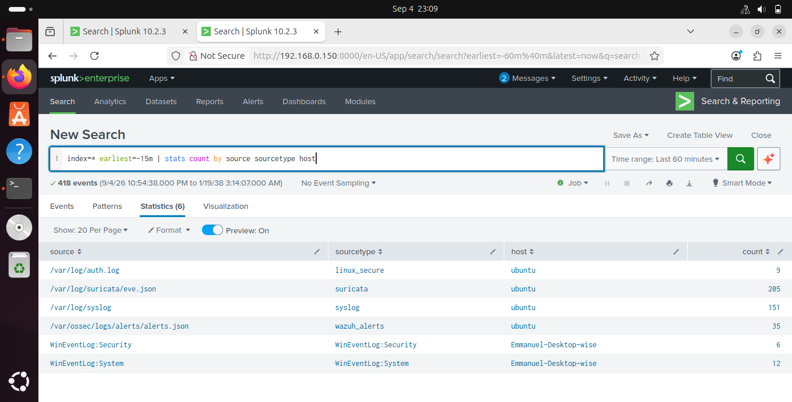
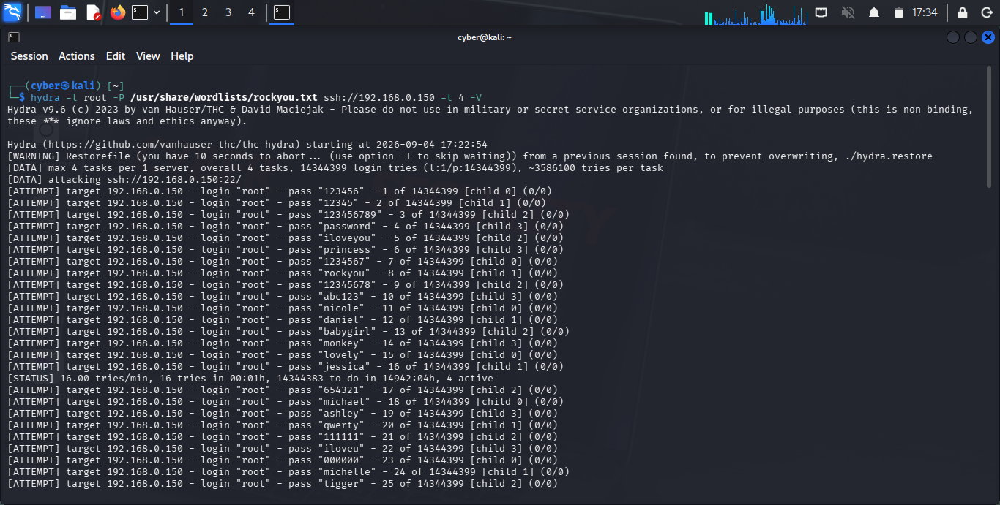
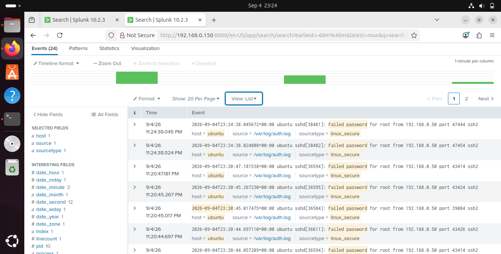
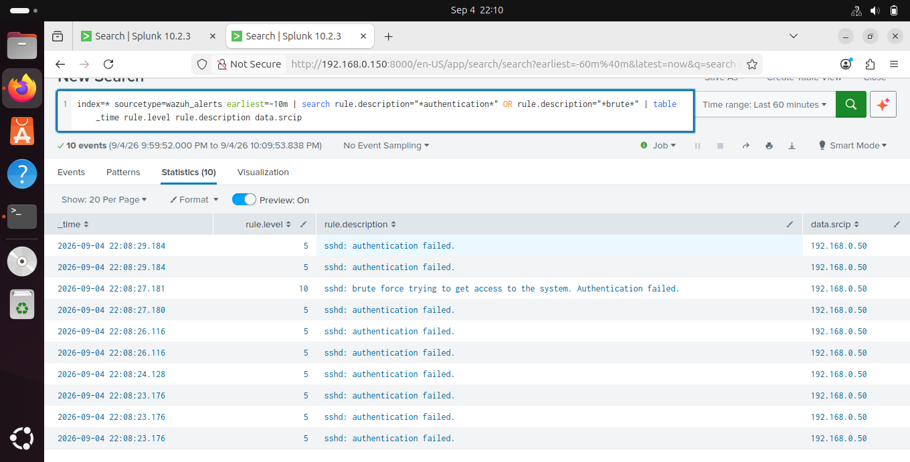
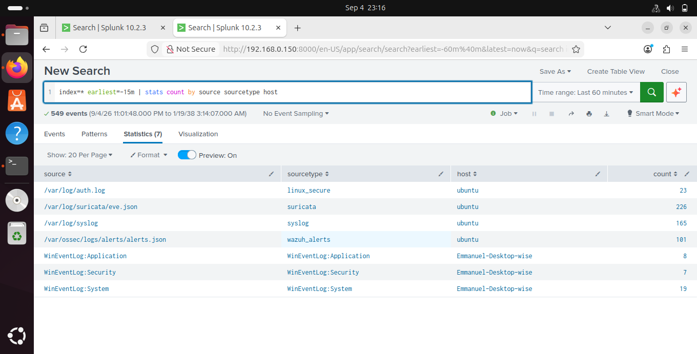

# Splunk SIEM: Centralized Security Monitoring

`Splunk` `Wazuh` `Suricata` `Windows` `Linux` `MITRE`  **Status: Complete**

## Overview

This is Phase 5 of a progressive security monitoring series. The earlier phases built the detection tools one at a time: host based intrusion detection with OSSEC, a full Wazuh SIEM, a hybrid cloud SOC on AWS, and a dual layer Suricata and Wazuh lab covering both network and host. Each of those projects ended with the same line, that Splunk was coming next. This is that project.

The idea here is different from the earlier phases. Those were about building detectors. This one is about pulling everything together. Instead of Suricata writing to its own log, Wazuh having its own dashboard, and the Linux and Windows logs sitting on separate machines, all of it now feeds one platform. Splunk ingests the network alerts, the host alerts, the raw Linux auth logs, and the Windows event logs at the same time, and lets you search and correlate across all of them.

That is what a real SOC looks like. One place where a single attack shows up across the network, the host, and the raw OS logs at once.

> Phase 1: OSSEC Host Based IDS
> Phase 2: Wazuh On Premise SIEM
> Phase 3: Wazuh and AWS Hybrid SOC
> Phase 4: Suricata and Wazuh Dual Layer Detection
> Phase 5: this project, all sources unified in Splunk

## Why centralize into Splunk

The earlier phases already proved the individual tools work. The problem was that the data lived in silos. Suricata in its log, Wazuh in its dashboard, the Linux and Windows logs on their own machines. Investigating one incident meant jumping between four places and stitching the timeline together in your head.

A SIEM fixes that. Everything gets indexed in one searchable platform, so a single query pulls the whole picture. When the SSH brute force hits the Ubuntu server, the same attack is now visible three ways in one search: the raw `Failed password` lines from the OS, the severity scored alert from Wazuh, and any network signatures from Suricata, all timestamped and lined up.

That is the gap between collecting logs and actually running security operations.

## Architecture

```
+----------------------------------------------------------------------+
|                          ATTACK SURFACE                              |
|   Kali Linux Attacker  192.168.0.50                                  |
|   SSH brute force, reconnaissance                                    |
+-----------------------------+----------------------------------------+
                              |
                              v
+----------------------------------------------------------------------+
|          UBUNTU SOC SERVER  192.168.0.150 / 192.168.56.101           |
|                                                                      |
|   +--------------+   +--------------+   +----------------------+     |
|   | Suricata     |   | Wazuh Mgr    |   | Linux OS Logs        |     |
|   | eve.json     |   | alerts.json  |   | syslog, auth.log     |     |
|   | (network)    |   | (host)       |   | (raw OS events)      |     |
|   +------+-------+   +------+-------+   +----------+-----------+     |
|          |                  |                      |                 |
|          +------------------+----------------------+                 |
|                             v                                        |
|                 +-----------------------+                            |
|                 |   SPLUNK ENTERPRISE   |                            |
|                 |   Indexer + Search    |                            |
|                 |   Web UI :8000        |                            |
|                 |   Receiver :9997      |                            |
|                 +-----------+-----------+                            |
+-----------------------------+----------------------------------------+
                             ^
                             |  forwards over :9997
                             |
+-----------------------------+----------------------------------------+
|          WINDOWS ENDPOINT  192.168.0.200                            |
|          Splunk Universal Forwarder                                 |
|          WinEventLog: Security, System, Application                 |
+----------------------------------------------------------------------+
```

| Component | Role | Detail |
|---|---|---|
| Ubuntu SOC Server | Splunk indexer plus all local sources | Splunk Enterprise 10.2.3 |
| Splunk Web UI | Search, dashboards, analysis | Port 8000 |
| Splunk Receiver | Ingests forwarder data | Port 9997 |
| Wazuh Manager | Host detection sensor into Splunk | Wazuh 4.7.5, JSON output |
| Suricata | Network detection sensor into Splunk | eve.json, ~49,895 ET rules |
| Windows Endpoint | Monitored endpoint | Splunk Universal Forwarder 10.2.3 |
| Kali Linux | Attacker | 192.168.0.50 |

A note on the design. In this project Wazuh runs only as a detection sensor feeding Splunk, not as a full standalone SIEM. Its indexer and dashboard components are switched off to keep things stable on a VM with limited RAM, and Splunk does the storage and search. Automated active response blocking is not the focus here, it was covered in the OSSEC and Suricata phases. This project is about getting everything into one place and correlating it.

## Data sources ingested

Four source types, six log streams, two hosts, all landing in Splunk at once.

| Source | Sourcetype | Host | Layer |
|---|---|---|---|
| `/var/log/suricata/eve.json` | `suricata` | ubuntu | Network |
| `/var/ossec/logs/alerts/alerts.json` | `wazuh_alerts` | ubuntu | Host detection |
| `/var/log/syslog` | `syslog` | ubuntu | OS system |
| `/var/log/auth.log` | `linux_secure` | ubuntu | OS authentication |
| `WinEventLog:Security` | `WinEventLog:Security` | Emmanuel-Desktop-wise | Windows security |
| `WinEventLog:System` | `WinEventLog:System` | Emmanuel-Desktop-wise | Windows system |
| `WinEventLog:Application` | `WinEventLog:Application` | Emmanuel-Desktop-wise | Windows application |

Search to confirm everything is live at the same time:

```spl
index=* earliest=-15m | stats count by source sourcetype host
```



## Configuration

### Splunk receiver on Ubuntu

Turn on the receiving port for the Windows forwarder in `/opt/splunk/etc/system/local/inputs.conf`:

```ini
[splunktcp://9997]
connection_host = ip
disabled = false
```

### Local source monitors on Ubuntu

```ini
[monitor:///var/log/syslog]
disabled = false
index = main
sourcetype = syslog

[monitor:///var/log/auth.log]
disabled = false
index = main
sourcetype = linux_secure

[monitor:///var/ossec/logs/alerts/alerts.json]
disabled = false
index = main
sourcetype = wazuh_alerts
```

Suricata's `eve.json` is monitored the same way. I used Wazuh's JSON output rather than the plain text `alerts.log` so the fields like rule level, description, source IP and MITRE mapping parse straight into Splunk instead of needing regex.

### Windows Universal Forwarder

On the Windows endpoint, `inputs.conf` collects the event logs through the Windows Event Log API:

```ini
[WinEventLog://Security]
disabled = false
index = main

[WinEventLog://System]
disabled = false
index = main

[WinEventLog://Application]
disabled = false
index = main
```

And the forwarder points at the Splunk receiver:

```
splunk add forward-server 192.168.0.150:9997
```

## Attack demonstration and detection

### SSH brute force, seen three ways

From Kali, a credential brute force against the Ubuntu SSH service:

```bash
hydra -l root -P /usr/share/wordlists/rockyou.txt ssh://192.168.0.150 -t 4 -V
```



The same attack then shows up in Splunk at different levels of detail.

First, the raw OS authentication failures from auth.log:

```spl
index=* sourcetype=linux_secure "Failed password" earliest=-10m
```

```
Failed password for root from 192.168.0.50 port 51986 ssh2
Failed password for root from 192.168.0.50 port 52006 ssh2
```



Second, and this is the important one, Wazuh's correlated detection with severity escalation:

```spl
index=* sourcetype=wazuh_alerts earliest=-10m
| search rule.description="*authentication*" OR rule.description="*brute*"
| table _time rule.level rule.description data.srcip
```

Individual failed logins come in as Level 5, `sshd: authentication failed`. But once Wazuh sees the pattern of repeated failures from one source, it escalates to Level 10, `sshd: brute force trying to get access to the system`, all tied to 192.168.0.50.

| _time | rule.level | rule.description | data.srcip |
|---|---|---|---|
| 22:08:23 | 5 | sshd: authentication failed | 192.168.0.50 |
| 22:08:26 | 5 | sshd: authentication failed | 192.168.0.50 |
| 22:08:27 | 10 | sshd: brute force trying to get access to the system | 192.168.0.50 |
| 22:08:29 | 5 | sshd: authentication failed | 192.168.0.50 |



Third, the whole attack window across every source:

```spl
index=* earliest=-15m | stats count by source sourcetype host
```

This shows the same window reflected across Suricata at the network layer, Wazuh and auth.log at the host layer, and the Windows logs, all in one frame.



The point of all this is having the raw evidence and the correlated detection side by side in one platform. The auth.log lines are the ground truth of what happened. The Wazuh alert is the interpreted, scored, attributable version an analyst would actually act on.

## Troubleshooting log

The real problems I hit and how I fixed them.

### Splunk could not read the Linux system logs

The syslog and auth.log inputs were configured correctly and the files were clearly being written to, but nothing from either ever showed up in Splunk. Suricata and Wazuh JSON came in fine, so the ingestion itself worked, which made this confusing at first.

The cause turned out to be permissions. Splunk runs as the `splunk` user. On Ubuntu, `/var/log/syslog` and `/var/log/auth.log` are owned `syslog:adm` with permissions `-rw-r-----`, so only the syslog user and the adm group can read them. That restriction is on purpose, auth logs hold sensitive data. The splunk user was not in the adm group, so it was silently failing to open the files.

The fix was one line, add splunk to the adm group and restart:

```bash
sudo usermod -aG adm splunk
sudo systemctl restart splunk
```

After that, syslog and linux_secure started flowing straight away. This is the classic Splunk on Linux trap. The config is right but the service account cannot read the protected logs.

### Duplicate ingestion from scattered config files

At one point Wazuh alerts were being counted two or three times over, and syslog and auth.log each showed up multiple times in the effective config.

The stanzas had piled up across several `inputs.conf` files, in `system/local`, `apps/launcher/local`, and `apps/search/local`. Splunk merges inputs from all of these, so appending to one file across multiple sessions just kept adding duplicates. On top of that both Wazuh's `alerts.log` and `alerts.json` were being monitored, so every alert came in twice.

I used `btool` to find every place a source was actually defined, then cut it down to one stanza per source and kept only the JSON Wazuh output:

```bash
sudo /opt/splunk/bin/splunk btool inputs list --debug | grep "monitor://"
```

btool shows the merged config across every location along with the file each setting comes from, which is the only reliable way to sort out this kind of "but I already deleted it" duplication.

### Windows forwarder inactive after downtime

After the lab sat idle for a while, the forwarder service was running but showed `Configured but inactive forwards`, and no Windows data was reaching Splunk.

The connection just had not re established after the downtime. The network path was fine, a `Test-NetConnection` to port 9997 succeeded. Restarting the forwarder service fixed it:

```powershell
Restart-Service SplunkForwarder
```

It flipped to `Active forwards: 192.168.0.150:9997` and the Windows logs came back. Worth remembering that forwarders can quietly go inactive after downtime, so it is something to check rather than assume.

## Splunk Free limitations

This lab runs on Splunk Free after the Enterprise trial ended. These constraints are worth being upfront about since they shape the setup.

| Limitation | Impact here |
|---|---|
| No authentication | Splunk Free drops login entirely, the web UI is open as admin on the local network. In production you would need Enterprise with role based access control. |
| 500 MB per day ingestion cap | Fine for lab volumes, but a real environment producing this many Suricata and Wazuh events would blow through it fast. |
| No alerting or scheduled searches | Real time triggered alerts are off. Detection here is done through searches. Automated response was shown in the OSSEC and Suricata phases, and Wazuh's own active response runs independent of Splunk's license anyway. |


## What this completes

Across five phases the series went from a single host based IDS engine to a SIEM pulling together network, host, and multi OS telemetry:

```
Phase 1  OSSEC             Raw host based detection engine
Phase 2  Wazuh             Full SIEM, multi agent, MITRE mapping
Phase 3  Wazuh and AWS     Hybrid cloud and on premise SOC
Phase 4  Suricata + Wazuh  Network layer added, HIDS plus NIDS
Phase 5  Splunk            All sources unified in one SIEM
```

Every detector built across the series now reports into one searchable place. You can pivot from a network signature to a host alert to a raw OS log for the same event in a single query, which is the basic day to day workflow of a SOC.

## Skills I have demonstrated

- Splunk Enterprise deployment, indexer, receiver, Universal Forwarder
- Onboarding multiple source types, file monitors, WinEventLog API, forwarder
- Correlating a single attack across network, host, and OS logs
- SPL search for detection and evidence retrieval
- Real troubleshooting, Linux log permissions, config precedence, forwarder recovery
- SIEM architecture and licensing tradeoffs

## Author

Emmanuel Siamoonga

LinkedIn, GitHub

> "Security is not a product, but a process." Bruce Schneier
